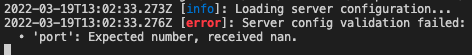
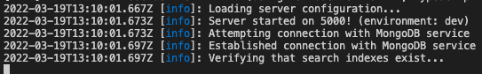

# Iamus Server Sources

## Installation

### MongoDB

The backend required MongoDB as the database that it uses. To install MongoDB on 
your local machine, you can follow this tutorial (select host os) [here](https://docs.mongodb.com/manual/administration/install-community/).

Alternatively, you can use the provided `Dockerfile` that utilises docker that will install and run the MongoDB 
instance within the container.
### Server dependencies

To install the project  project, you need to run the following command:

```sh
yarn install
```

## Building and setup

Ensure that all of the server dependencies have been installed before attempting to
carry out the building steps of the server.

### OpenAPI Schema generation
Once you have configured all of the environment variables, you will need to run another 
step to generate the JSON version of the `swagger.yaml` file which is used to provide 
an OpenAPI schema. The following command is used to convert the contents of `swagger.yaml`
into `swagger.json`:
```
yarn transform-yaml
```

### Environment variables

The server uses environment variables to store some configuration parameters that are
environment specific. The file that is used by the server is called `.env`. It should 
be created in the root of the disk and this is the contents that should be within the 
disk:
```
# Database
MONGODB_PASSWORD=
MONGODB_CONNECTION_URI=

# Authentication
JWT_SECRET_KEY=
JWT_REFRESH_SECRET_KEY=

# Server port
PORT=5000

# Resources
RESOURCES_FOLDER=./resources

# Communication with the frontend
FRONT_END_URI=http://localhost:3000
```
**Note**: `sample.env` has an example copy of a partial configuration.


Some of these options have 'sensible' defaults such as the `RESOURCES_FOLDER` that will use 
`./resources` as the folder to save uploaded files into a specific directory structure.
However, some variables have no defaults because they either need to be specified very
directly or are **unsafe** to be shared across because they are critical to the server's
security.

The `JWT_*` environment variables can be any decent long password which is used as a secret 
for generating signed JWTs. To find out more about JWTs, please read the introduction about
them here [here](https://jwt.io/introduction).

The `MONGO_*` environment variables are used to specify what URL the server should use 
when connecting to a database. This is designed so that the server can be configured to 
work with any hosted MongoDB environment. The `MONGODB_PASSWORD` field can be left 
as empty if the host database has no configured password (this configuration is *not recommended*
for security reasons).

An example of a MongoDB URI is:
```
mongodb://localhost:27017/?readPreference=primary
```
If you follow the MongoDB installation process, it will likely give you 
the connection URI or show steps how to deduce the URI. The server needs
the URI to **connect** to the database.

To verify that the environment variables are correctly configured, you can 
attempt to start the server using `yarn dev`. If a required environment
variable is not properly set or if it does not conform to an expected 
format, the server will report the errors and you can try again.

An example of an error occurring when mis-configuring the server is:



If everything is probably configured, the server will show the following messages:


### Building a production instance

To build a production instance of the server, you can run the following command:

```
yarn build
```

This will build a production version of the server sources and output them into the
`dist/` folder.

## Running the server

### Running the production build

Ensure that you have pre-built the server using the steps in the `build` section 
and sub section `Building a production instance` before continuing.

To run the production build, you can run the following command:

```
yarn start
```

### Running development build

To run the development build of the server, you can use the following command:
```
yarn dev
```

## Commands

-   `yarn run build`: Compile Typescript files.
-   `yarn run clean`: Remove all build artifacts.
-   `yarn run start`: Run the server (you must have run `npm run build` prior to this).
-   `yarn run test`: Run the test suite.
-   `yarn run fmt`: Format all Typescript files.
-   `yarn run lint`: Run ESLint on all Typescript files.
-   `yarn run tcheck`: Type-check all Typescript files but do not emit any JavaScript.
-   `yarn run dev`: Run server in development mode (listen for changes and re-compile).
-   `yarn run transform-yaml` Generate a JSON equivalent OpenAPI schema from `swagger.yaml`
